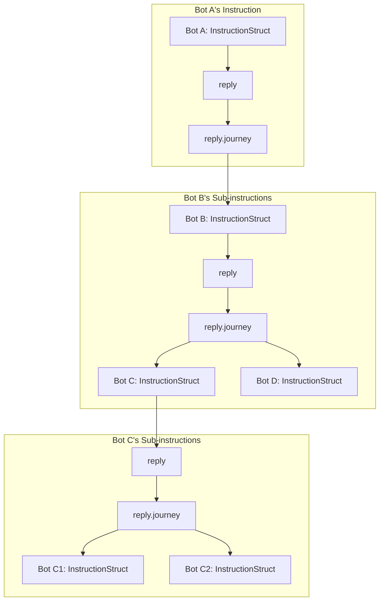

> **Translation Note**: This is a machine-translated version. While we strive for accuracy, some nuances may be lost in translation. For the definitive reference, please consult the **Chinese version**.

# Instruction Struct (InstructionStruct)

**InstructionStruct** is the core carrier of Lnsaw API, representing a structured interaction paradigm. This document aims to elucidate its design philosophy.

For intuitive demonstration of its structure, JSON format is used in the following examples. **Please note this is merely a representation form and does not mandate that InstructionStruct must be a JSON object** - it can be any serialization format satisfying this data model.

**InstructionStruct** is a universal communication unit model applicable to various interaction scenarios like Lnsaw API, RPC, gRPC, etc. It essentially is **an entity carrying "Instruction"**, similar to how matter carries sound waves or photons carry energy.

> For complete JSON Schema definition, please refer to [InstructionStruct.json].

## Features
**InstructionStruct** natively supports multiple features such as: batch requests, full-link tracing, instruction replay.

## Structure of InstructionStruct

The birth of **InstructionStruct** is based on Reality and Instruction Thinking. Its naming doesn't adopt technical terms but borrows from the "letter" scenario in reality for more intuitive cognition.

### Main Structure
**InstructionStruct** mainly consists of three parts:
+ 1. **Instruction Identification**: Contains three IDs for full-link tracing (detailed later)
+ 2. **Dispatch**: Replaces traditional Request, describing the sender, intent and content of the instruction
+ 3. **Reply**: Replaces traditional Response, describing the processing result of the instruction

```json
{
  "globalId": "DateTime.Utc +_+ GUID",
  "parentId": null,
  "selfId": "DateTime.Utc +_+ GUID",
  "dispatch": {},
  "reply": {}
}
```

### Dispatch
`dispatch` is analogous to a letter, consisting of two parts: envelope (`envelope`) and letter body (`letter`).

#### Envelope

`envelope` contains the metadata of the instruction, providing context for the entire lifecycle of the instruction. Whether it's system infrastructure (like gateways, auditing) for routing and tracing, or the final recipient (business services) for preprocessing and business distribution, all rely on this information. This allows all parties to fulfill their responsibilities without deeply parsing the business content (letter).

+ **postedAt**: The sending time of the instruction, usually automatically generated by the agent initiating the instruction (like browser, HTTP client)
+ **InstructionType**: The type of instruction. This field is mainly used by various infrastructure levels (like gateways, load balancers, auditing systems) to quickly determine the core intent of the instruction
  + **DO**: **Execute**, a universal type indicating the hope that the receiver executes an action or process. Use this type when other types don't apply
  + **GET**: **Acquire**, meaning "I need you to provide me with something". For clarity of acquisition scope, can be subdivided into:
    + **GET-F (Full)**: Expect to acquire a complete entity
      > "Please bring me the 'John Doe' file folder from the filing cabinet"
    + **GET-P (Partial)**: Expect to acquire only part of the entity's information
      > "Please bring me the personal information page of the 'John Doe' file folder. No need to bring other parts of the folder"
  + **PUT**: **Give**, meaning "I give you an entity/part of an entity". For precise expression of intent, can be subdivided into:
    + **PUT-C (Create)**: Expect to **create** a new entity. Execute operation only when target doesn't exist
      > "I give you an employee 'John Doe' file folder, please put it in the filing cabinet. If there's already a 'John Doe' file folder in the cabinet, do nothing"
    + **PUT-U (Update)**: Expect to **update** an existing entity. Execute operation only when target exists
      > "I give you an employee 'John Doe' file folder, please replace the 'John Doe' file folder in the filing cabinet. If there's no 'John Doe' file folder in the cabinet, do nothing"
    + **PUT-S (Set)**: Expect to ensure an entity exists and its content exactly matches the description in the instruction
      > "I give you an employee 'John Doe' file folder, please ensure the 'John Doe' file in the filing cabinet is exactly this one I'm giving you. If it didn't exist before, put this one in; if it existed before, take out the old one and put this new one in"
    + **PUT-X (Patch)**: Expect to **modify** **part** of an entity. This operation can be used to update or delete (set to null) a certain part
      > "I give you a personal information page belonging to a 'John Doe' file folder, please replace the old personal information page in the 'John Doe' file folder in the filing cabinet. If there's no 'John Doe' file in the cabinet at all, do nothing"
      > "Please take out and discard the personal information page from the 'John Doe' file folder in the filing cabinet. If there's no 'John Doe' file in the cabinet at all, do nothing"
  + **DEL**: **Discard**, meaning "I don't want this thing anymore, you can discard it". This operation targets the entire entity
      > "The 'John Doe' file folder in the filing cabinet is no longer needed, please remove and destroy the entire file folder from the filing cabinet"
+ **dispatchType**: The data format of dispatch.letter (like json, xml)
+ **replyType**: The expected data format of reply.letter (like json, xml)
+ **sender**: **Sender**. Indicates which Actor sent this instruction (for detailed definition of Actor, please refer to Lnsaw Actor documentation)
  + **actorType**: **Actor Type**. Indicates the category of the sending entity, e.g.: NaturalPerson, LegalPerson, Bot
  + **actor**: **Actor Identifier**. The unique identifier of the sending entity. Its value depends on authentication status and method:
    > **Anonymous request**: "actor": "anonymity"
    > **Token authentication**: "token:A35D8X3E5A8CX3XD5F8A3GS8"
    > **JWT authentication**: "JWT:fxcgaeff65F89GR5df21f5e=="
  + **agent**: **Agent**. Refers to the Actor that actually sent this instruction (usually a Bot). For example, when a natural person user accesses the system through a browser, the real sender is the browser Bot
    > "bot:browser_chrome_edge"
    > "bot:actorcenter.lnsaw.com:443,botId:2358sef35c8sfe2sa6f85"
+ **receiver**: **Recipient**. Indicates the intended receiver of this instruction
  + **endpoint**: **Receiving Endpoint**. The network address of the recipient for physical routing
    > "https://actorcenter.lnsaw.com:443"
  + **route**: **Routing Path**. A path array for specifying specific processing nodes within the application. This field is key for implementing advanced routing strategies like batch requests
    > ["/api/auth"]
  + **actor**: **Target Actor**. Besides using path abstraction, can also directly specify one or more specific Bot Actors as recipients. Its routing logic is similar to the `route` array, providing possibility for more granular instruction distribution
    > ["bot:auth_service_v1"]
    > ["bot:gateway_asia_1", "bot:gateway_eu_1"]
  + **【Important Constraint】**: `actor` and `route` arrays are mutually exclusive in an instruction and cannot be used simultaneously. This constraint ensures instructions can be clearly and accurately routed in batch request scenarios
+ **intent**: **Business Intent**. An intent array for declaring the business goals the instruction needs to achieve. **This field works collaboratively with receiver and is core to implementing batch requests and complex business flows.** Its content can be highly customized according to business needs, providing great expressive flexibility for the system
  > ["NaturalPerson.Login"]
  > ["NaturalPerson.Login","NaturalPerson.Info"]
  > ["Order.Place.Prepare","Inventory.Lock","Payment.Create"]

#### Letter Body

`letter` carries the specific business parameters of the instruction, playing a role similar to the Request Body in traditional RESTful architecture. This field is designed as an array format, aiming to work collaboratively with `receiver` and `intent` to form the final link in implementing batch requests.

+ `receiver` specifies "where to process" (target node)
+ `intent` specifies "what to do" (business goal)
+ `letter` specifies "what to use" (operation parameters)

#### JSON Structure
```json
"dispatch": {
  "envelope": {
    "postedAt": "2025-11-21T10:40:00.000Z",
    "InstructionType": "DO",
    "dispatchType": "json",
    "replyType": "json",
    "sender": {
      "actorType": "NaturalPerson",
      "actor": "anonymity",
      "agent": "bot:browser_chrome_edge"
    },
    "receiver": {
      "endpoint": "https://actorcenter.lnsaw.com:443",
      "route": ["/api/auth"]
    },
    "intent": ["NaturalPerson.Login"]
  },
  "letter": [{
    "username": "john_doe",
    "password": "encrypted_hash"
  }]
}
```

### Reply
`reply` describes the final processing result of the instruction, consisting of the following four parts.

#### Receipt
`receipt` carries the basic metadata of the instruction response, focusing on network and protocol level status, similar to HTTP Response Headers.

+ **replyAt**: **Reply Time**. The timestamp when the response party sent this reply, corresponding to dispatch.envelope.postedAt (send time), can be used to calculate total duration.
+ **protocolStatus**: **Protocol Layer Status Identifier**. Describes specific events or statuses occurring at the protocol level, e.g.: TIMEOUT, NETWORK_ERROR, REJECTED, RATE_LIMITED.
+ **protocolCode**: **Protocol Layer Status Code**. Machine-readable standardized codes corresponding to protocolStatus. For example, when protocolStatus is TIMEOUT, protocolCode might be "408".

#### Letter Body
`letter` is an array carrying the final business results of instruction processing. Must strictly ensure the element order in reply.letter array corresponds one-to-one with dispatch.letter array.

+ **code**: **Business Status Code**. A custom string or number for precisely identifying the processing result of business logic (e.g.: "AUTH_FAILED", "INSUFFICIENT_BALANCE").
+ **message**: **Business Message**. Readable status description information for developers or users, usually for debugging or interface prompts.
+ **data**: **Business Data**. The payload data returned when instruction is successfully processed. Its structure is determined by the specific intent.

#### Notes (internal)
`internal` is a highly free-form array used as "internal process recording" for instruction processing.

+ Each InstructionStruct instance has its own independent reply.internal context.
+ Only the Bot currently directly processing this instruction can modify its internal field, ensuring strict correspondence between notes and instruction lifecycle.
+ **Security Tip**: This field usually contains system internal details and should be filtered in the final reply unless deemed necessary to include.

> // Initial instruction (Context-1)
> {
>   "internal": [
>     {"bot": "Gateway", "note": "Request received"}  // Only Gateway can write here
>   ],
>   "journey": [
>     // Sub-instruction (Context-2)
>     {
>       "internal": [
>         {"bot": "AuthService", "note": "Starting verification"} // Only AuthService can write here
>       ]
>     }
>   ]
> }

#### Log (journey)
`journey` is a very important part of the entire InstructionStruct. It is an `InstructionStruct` array that records the complete instruction tree through it, making InstructionStruct a complete instruction recording entity.

For example, Bot A sends an instruction to Bot B, and Bot B calls Bot C and Bot D during processing. When Bot B returns response to Bot A, it will record **the complete instruction bodies of its interactions with Bot C and Bot D** into the current instruction's `reply.journey` array. This forms a complete instruction tree, achieving full-link tracing and instruction replay.


```json
"reply": {
    "receipt ": {
      "replyAt": "...",
      "protocolStatus": "completed",
      "protocolCode": "200"
    },
    "letter": [
      {
        "code": 200,
        "message":"",
        "data": {}
      }
    ],
    "internal": [
      {
        "check": true,
        "updatePassword": true,
        "PutAcotrLog": "send success"
      }
    ],
    "journey": []
```
***
# Features

## Batch Requests: From "Discrete Interaction" to "Batch Intelligence"

### Design Philosophy
Elevate traditional "question-answer" communication to "requirement list" style batch negotiation. This is not just performance optimization, but fundamental transformation of communication paradigm.

### Specifications and Patterns
To implement batch requests, instruction construction must follow these rules and patterns.

#### Basic Principles
+ **Singularity**: A batch instruction can only contain one InstructionType
+ **Consistency**: A batch instruction can only point to one receiver.endpoint  
+ **Mutual Exclusivity**: actor and route arrays in receiver cannot be mixed

#### Supported Patterns
Based on different combinations of array lengths for `receiver.actor/receiver.route`, `intent`, and `letter`, multiple batch request patterns can be achieved.

| **Pattern** | receiver.actor/receiver.route | intent | letter | Description |
|-------------|--------------------------------|--------|--------|-------------|
| **Multi-target, Multi-task** | `N` | `N` | `N` | Distribute N different tasks to N different targets |
| **Single-target, Multi-task** | `1` | `N` | `N` | Send N different tasks to 1 target for processing |
| **Single-target, Single-task, Multi-parameter** | `1` | `1` | `N` | Send 1 task's N parameter sets to 1 target for processing |
| **Single-target, Single-task, Single-parameter** | `1` | `1` | `1` | Standard single request |

#### Execution Strategies
The implementation layer should provide configurable strategy mechanisms to support different execution approaches for batch instructions.

For example, for single-target, single-task, multi-parameter instructions, strategy configuration can determine:

+ Parallel execution: Distribute multiple parameters to multiple controller instances for simultaneous processing to improve throughput
+ Serial execution: Start processing next parameter only after previous parameter processing completes, to ensure sequence or reduce resource contention

Specific configuration and implementation methods (like through interceptors, annotations, configuration files, etc.) are determined by each language or framework's adaptation library.

### Value and Advantages
InstructionStruct's batch requests are not simple functional features, but an efficiency revolution in communication paradigm. Through native batch design at application layer, it brings unprecedented performance benefits and engineering efficiency.

+ 1. **Ultimate Network Efficiency**
  + **One Connection, Hundreds of Interactions**: Merge hundreds of discrete HTTP requests into one network call, **eliminating repeated TLS handshakes, TCP connections and certificate verification overhead**
  + **Header Overhead Approaches Zero**: Hundreds of requests share the same protocol headers, **spreading fixed network overhead to negligible levels**

+ 2. **Revolutionary Performance Improvement**  
  + **Throughput Leap**: Server can receive, schedule, and process massive tasks at once, **fully leveraging the concurrent potential of modern multi-core CPUs and asynchronous architecture**
  + **Significant Latency Reduction**: Especially in mobile networks and high-latency environments, completing all operations in one round trip, **user experience achieves qualitative leap**

+ 3. **New Engineering Experience**
  + **Logic Simplification**: Client liberated from complex state management and error retries, only needs to handle one unified call
  + **Resource Saving**: Greatly reduces connection count and memory usage for client, gateway, and server, lowering cloud service costs  
  + **Native Observability**: Entire operation set forms complete trace tree in journey, debugging and monitoring become unprecedented clear

**This is no longer optimization, but dimensional elevation. Moving from "handicraft workshop" to "scaled intelligent production".**

### Example: CDN Static Resource Loading

A typical Vue/React single-page application initial screen may need to load:
+ 15 component JS chunks (chunk.js)
+ 8 CSS style fragments  
+ 12 SVG icons and interface images
+ 5 web font files
+ 7 JSON configuration files (routes, permissions, etc.)
**Total about 47 static resources!**

#### Traditional Approach: 47 Independent HTTPS Requests:
```
Request 1: GET /chunk-abc123.js
↳ TLS handshake + request headers + response headers + 15KB data

Request 2: GET /chunk-def456.js
↳ TLS handshake + request headers + response headers + 8KB data

Request 3: GET /icons/user.svg
↳ TLS handshake + request headers + response headers + 2KB data

...(repeat 44 times)...
```

**Problems Explode:**
+ Browser concurrency limits (usually 6-8 per domain), subsequent requests must queue
+ 47 TLS handshakes overwhelm CPU
+ Mobile network environment amplifies all problems due to high latency

#### InstructionStruct Batch Approach: 1 Intelligent Request

```json
{
  "InstructionType": "GET-F",
  "dispatchType": "json",           // I describe requirements using JSON
  "replyType": "binary-stream",     // But I expect you to return binary stream
  "letter": [
    {"path": "/chunk-1.js", "hash": "", "priority": 1},
    {"path": "/chunk-2.js", "hash": "", "priority": 1},
    {"path": "/background.jpg", "hash": "", "priority": 2}
  ]
}
```

**Performance Comparison Data (Estimated, Not Actually Tested)**

| Metric | Traditional Approach | InstructionStruct Batch | Improvement |
|--------|---------------------|-------------------------|-------------|
| TLS Handshake Count | 47 times | 1 time | **98% Reduction** |
| Header Information Total | ~188KB | ~4KB | **98% Reduction** |
| Queuing Wait Time | High (limited by concurrency) | No queuing | **Eliminate Bottleneck** |
| Total Completion Time | ~3.2 seconds | ~1.1 seconds | **66% Reduction** |

**Deeper Technical Revolution**

This is not just about reducing request count, but redefining frontend resource loading pattern:

+ **1. Priority Control**: Tell CDN which resources need priority return by adding priority field in letter
+ **2. Smart Caching**: CDN can batch validate ETag, only return changed resources
+ **3. Progressive Loading**: CDN can stream return, critical resources arrive first and render first
+ **4. Connection Reuse**: One connection carries entire page's static resources

#### **Significance**

This actually redefines the interaction protocol between browser and CDN:

+ From: Browser limited by HTTP protocol, can only "purchase in small batches"
+ To: Browser "places a master purchase order" through InstructionStruct, CDN intelligently distributes

**Especially in 5G, mobile network and other high-latency environments, the performance improvement brought by this ability to break through concurrency limits is revolutionary!**

**Analogy: From "Random Read/Write" to "Sequential Read/Write"**

Traditional resource loading is like mechanical hard disk random read/write:

+ Frequent head seeking: Each request requires re-establishing connection, negotiating TLS, transmitting header information
+ Low I/O efficiency: Most time spent on "addressing" rather than "data transmission"
+ Concurrency bottleneck: Like disk queue depth limit, browser concurrency number becomes performance ceiling

InstructionStruct batch requests are like solid-state drive sequential read/write:

+ Continuous large block transmission: One "addressing" (TLS handshake), continuous transmission of all data
+ Maximize throughput: Network bandwidth truly used for business data transmission, not protocol overhead
+ Eliminate queuing delay: Like SSD's high queue depth, all resources processed "in parallel"

## Full-Link Tracing: From "Fragment Puzzle" to "Complete Narrative"

### Design Philosophy

Make each instruction the recorder of its own history, transforming distributed system debugging from "multi-source log correlation" detective game to "single-file reading" smooth experience.

### Core Mechanism

InstructionStruct's full-link tracing is not an externally attached function, but natural embodiment of its inherent spatiotemporal continuity. Through the recursive nested structure of `journey` field, each instruction automatically records its complete lifecycle trajectory.

#### 1. Instruction Tree Tracing

```json
{
  "globalId": "9BD8BC07AA6C6057CD722C553703096A",
  "parentId": null,
  "selfId": "9BD8BC07AA6C6057CD722C553703096A",
  "dispatch": {...},
  "reply": {
    "journey": [
      {
        "globalId": "9BD8BC07AA6C6057CD722C553703096A",
        "parentId": "9BD8BC07AA6C6057CD722C553703096A",
        "selfId": "A872F42034EBEF5A53291F7824DC16B6",
        "internal": [...], // Sub-instruction internal processing records
        "journey": [...]  // Grandchild instructions (infinitely recursive)
      },
      {
        "globalId": "9BD8BC07AA6C6057CD722C553703096A",
        "parentId": "9BD8BC07AA6C6057CD722C553703096A",
        "selfId": "4FCB6DB1876D1D634C9B7588C97DBAA1",
        "internal": [...], // Sub-instruction internal processing records
        "journey": [...]  // Grandchild instructions (infinitely recursive)
      }
    ]
  }
}
```
**Technical Value**: This self-similar structure enables complete restoration of call chains at any depth, providing native solution for distributed system debugging.

#### 2. Processing Context Isolation

+ `internal` field records all Bot processing logs within current instruction boundary
+ `journey` field records cross-instruction-boundary collaborative calls
+ Clear responsibility separation avoids log pollution, ensures precise problem localization

### Application Scenarios

#### Fault Diagnosis

+ **Traditional Approach**: Need to manually correlate traceId across multiple component logs like gateway, service A, service B, database
+ **InstructionStruct Approach**: Directly retrieve failed instruction's complete journey, entire call chain immediately clear

```JSON
// Instantly identify performance bottleneck
{
  "globalId": "9BD8BC07AA6C6057CD722C553703096A",
  "parentId": null,
  "selfId": "9BD8BC07AA6C6057CD722C553703096A",
  "dispatch": {...},
  "reply": {
    "receipt": {
      "replyAt": "2025-01-21T10:40:03.250Z",
      "protocolStatus": "completed",
      "protocolCode": "200"
    },
    "letter": [{
      "code": 200,
      "message": "Order created successfully",
      "data": {"orderId": "ORD-20250121-001"}
    }],
    "internal": [
      {"step": "Parameter validation", "duration": "5ms", "status": "passed"},
      {"step": "Risk control check", "duration": "15ms", "status": "passed"},
      {"step": "Prepare sub-instructions", "note": "Distribute inventory check and user verification"}
    ],
    "journey": [
      {
        "globalId": "9BD8BC07AA6C6057CD722C553703096A",
        "parentId": "9BD8BC07AA6C6057CD722C553703096A",
        "selfId": "A872F42034EBEF5A53291F7824DC16B6",
        "dispatch": {...},
        "reply": {
          "receipt": {...},
          "letter": [{"code": 200, "message": "Sufficient inventory"}],
          "internal": [
            {"step": "Inventory query", "duration": "50ms", "result": "sufficient"}
          ],
          "journey": []
        }
      },
      {
        "globalId": "9BD8BC07AA6C6057CD722C553703096A",
        "parentId": "9BD8BC07AA6C6057CD722C553703096A",
        "selfId": "4FCB6DB1876D1D634C9B7588C97DBAA1",
        "dispatch": {...},
        "reply": {
          "receipt": {...},
          "letter": [{"code": 200, "message": "User verification successful"}],
          "internal": [
            {"step": "Identity verification", "duration": "1200ms", "result": "success"}  // Performance bottleneck!
          ],
          "journey": []
        }
      }
    ]
  }
}
```
#### Performance Analysis

By analyzing processing duration of each node in `journey` tree, can:

+ Precisely locate system bottlenecks
+ Optimize cross-service call chains
+ Verify actual effects of architecture improvements

#### Business Auditing

`journey` field naturally forms complete ledger of business operations, meeting compliance requirements:

+ Who executed what operation and when
+ Which systems and data the operation involved
+ Processing result of each step

#### Technical Advantages

+ **Zero Intrusiveness**: Tracing capability built into communication protocol, no additional SDK injection needed
+ **Complete Context**: Not only records call relationships, but also preserves processing context of each node
+ **Developer Friendly**: Debugging without jumping between multiple systems, single InstructionStruct contains all information
+ **Storage Efficient**: Structured data saves more storage space than traditional logs
+ **Analysis Ready**: Native structured design adapts to search engines like Elasticsearch, supports out-of-the-box business monitoring and aggregation analysis

#### Comparison with Traditional Solutions

| Dimension | Traditional Distributed Tracing | InstructionStruct Tracing |
|-----------|----------------------------------|---------------------------|
| **Data Completeness** | Partial sampling, may lose critical paths | Full recording, never lost |
| **Context Association** | Need additional business parameter passing | Natively contains complete business context |
| **Debugging Efficiency** | Need correlated queries across multiple systems | Single file contains complete call chain |
| **Architecture Dependency** | Need to deploy independent tracing system | Built into communication protocol itself |
| **Integration Cost** | Each service needs SDK introduction, collector configuration | Native support, only need to follow protocol specification |
| **Maintenance Cost** | Need to maintain independent tracing storage and query systems | Tracing data naturally flows with business instructions |
| **Learning Cost** | Need to learn specialized query syntax like Zipkin/Jaeger | Directly read structured JSON, no new skills needed |

## Instruction Replay: From "Recording History" to "Mastering History"

### Design Philosophy
When instruction's spatiotemporal continuity is completely preserved, we gain the ability of "time travel" in digital world - letting history serve testing, debugging and optimization.

### Core Value: Making Data Generate Compound Interest
**When possessing:**
+ Complete instruction tree (journey)
+ Processing intent of each node (internal)
+ Business parameters and results (letter)

### This means you can:

#### 1. Precise Fault Reproduction

```bash
# Directly send online failed instruction to test environment
curl -X POST https://test-env/replay \
  -d @failed_instruction.json
```
**Value**: Developers can 100% reproduce online bugs locally, bidding farewell to "it works on my machine" dilemma

#### 2. Intelligent Stress Testing
```JSON
{
  "replay_mode": "stress_test",     // Stress test mode: ignore annotations, focus on performance
  "instruction": "{original_instruction}",
  "annotations": {}  // No business explanation needed during stress testing
}
```
**Value**: Use real business traffic for stress testing, closer to real scenarios than manually constructed data

#### 3. Newcomer Training Revolution
```JSON
{
  "replay_mode": "training",
  "instruction": "{original_instruction}",
  "annotations": {
    "Key Business Logic": "...",
    "Common Pitfalls": "This location previously had bugs due to timezone issues", // Inherit experience!
    "Performance Optimization Points": "This query added Redis cache",
  }
}
```
**Value**: New employees intuitively understand system operation by replaying real business flows

#### 4. Architecture Upgrade Verification

```bash
# Flow production environment instructions back to new version system
old_system_journey | new_system_replay
```
**Value**: Ensure system refactoring maintains completely consistent processing results for real business