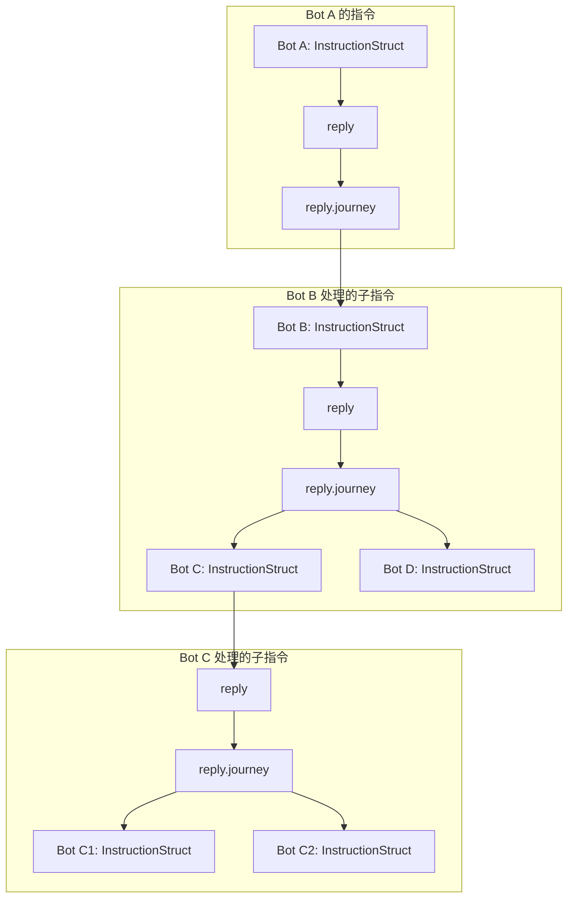

# 指令体（InstructionStruct）

**InstructionStruct** 是 Lnsaw Api 的核心载体，代表了一种结构化的交互范式。本文档旨在阐述其设计理念。

为直观展示其结构，下文以 JSON 格式为例。**请注意，这仅是一种表示形式，并非限定 InstructionStruct 必须为 JSON 对象**，它可以是任何满足此数据模型的序列化格式。

**InstructionStruct** 是一种通用的通信单元模型，可应用于 Lnsaw API、RPC、gRPC 等多种交互场景。它本质上是一个**承载“Instruction”的实体**，其关系如同物质承载声波，或光子承载能量。

>如需获取完整的 JSON Schema 定义，请参阅 [InstructionStruct.json]。

## 特性
**InstructionStruct** 原生支持多种特性，例如：批量请求、全链路追踪、指令回放。

## InstructionStruct 的结构

**InstructionStruct** 的诞生基于现实与指令思想，其命名未采用技术术语，而是借鉴了现实中“信件”的场景，以追求更直观的认知。

### 主结构
**InstructionStruct** 主要由三部分构成：
+ 1、**指令标识**：包含三个ID，用于全链路追踪（详见后文）。
+ 2、**发信 (dispatch)**：替代传统的Request，描述了指令的发出方、意图和内容。
+ 3、**回信 (reply)**：替代传统的Response，描述了指令的处理结果。
``` JSON
{
  "globalId": "DateTime.Utc +_+ GUID",
  "parentId": null,
  "selfId": "DateTime.Utc +_+ GUID",
  "dispatch": {},
  "reply": {},
}
```
### 发信 (dispatch)
`dispatch` 类比于信件，由信封 (`envelope`) 和信文 (`letter`) 两部分组成。

#### 信封 (envelope)

`envelope` 包含了指令的元数据，为指令的整个生命周期提供上下文。无论是系统基础设施（如网关、审计）用于路由和追踪，还是最终的收件人（业务服务）用于预处理和业务分发，都需要依赖此部分信息。 这使得各方无需深度解析业务内容（letter）即可完成各自职责。

+ **postedAt**：指令的发送时间，通常由发起指令的代理（如浏览器、HTTP客户端）自动生成。
+ **InstructionType**：指令的类型。此字段主要供各级基础设施（如网关、负载均衡器、审计系统）使用，用于快速判断指令的核心意图。
  + **DO**：**执行**，一个通用类型，表示希望接收方执行一个动作或流程。当其他类型不适用时，可使用此类型。
  + **GET**：**获取**，表示“我需要你为我提供某物”。为明确获取范围，可细分为：
    + **GET-F (Full)**:期望获取一个完整的实体。
      >"请将档案柜中的‘张三’档案袋，拿给我看看"
    + **GET-P (Partial)**:期望只获取实体的部分信息。
      >"请将档案柜中的‘张三’档案袋的个人信息页，拿给我看看。档案袋中的其他部分不用拿给我。"
  + **PUT**: **给予**，表示“我给你一个实体/实体的一部分”。为精确表达意图，可细分为：
    + **PUT-C (Create)**: 期望**创建**一个新实体。仅当目标不存在时执行操作。
      >“我将一份员工‘张三’的档案袋交给你，请你放入档案柜。如果柜子里已经有一个‘张三’的档案袋，什么也不用做。”
    + **PUT-U (Update)**: 期望**更新**一个已存在的实体。仅当目标存在时执行操作。
      >“我将一份员工‘张三’的档案袋交给你，请你替换掉档案柜中的‘张三’档案袋。如果柜子没有‘张三的档案袋’，什么也不用做。”
    + **PUT-S (Set)**: 期望确保某个实体存在，并且其内容与指令所描述的完全一致。
      >“我将一份员工‘张三’的档案袋交给你，请你确保档案柜中‘张三’的档案就是我给你这份。如果之前没有，就把这份放进去；如果之前有，就把旧的拿出来，把这份新的放进去。”
    + **PUT-X (Patch)**: 期望**修改**实体的**一部分**。此操作可用于更新或删除（置空）某个部分。
      >“我将一页属于一份‘张三’档案袋的个人信息页给你，请你替换掉档案柜中‘张三’档案袋里的旧的个人信息页。如果柜子里根本没有‘张三’的档案，什么也不用做。

      >“请将档案柜中‘张三’档案袋中的个人信息页拿出来扔掉，如果柜子里根本没有‘张三’的档案，什么也不用做。
  + **DEL**: **丢弃**，表示“此物我不要了，你可以将其丢弃”。此操作针对整个实体。
      >“档案柜里的‘张三’档案袋不需要了，请你把整个档案袋从档案柜中移除并销毁。”
  + **NOTIFY**：**通知**，一种单向通信机制，用于告知接收方一个事件或状态，而不期望或要求其对通知内容本身进行业务处理。
    + **NOTIFY-S (Silent)**：**静默通知**，发送后不期待任何形式的响应，适用于“尽力而为”的非关键事件广播。
    + **NOTIFY-A (Acknowledged)**：**回执通知**，要求接收方必须在协议层面返回一个送达回执，以确保信息被可靠接收。
+ **dispatchType**：发信的 dispatch.letter 数据格式（如 json, xml）。
+ **replyType** 期望回信的 reply.letter 数据格式（如 json, xml）。
+ **sender**：**发件人**。表明是哪个 Actor 发送了此指令。（关于 Actor 的详细定义，请参阅 Lnsaw Actor 文档）。
  + **actorType**：**Actor 类型**。表明发件主体的类别，例如：NaturalPerson（自然人）、LegalPerson（法人）、Bot（机器人）。
  + **actor**：**Actor的标识**。发件主体的唯一标识。其值根据认证状态和方式而定：
    >**匿名请求**："actor": "anonymity",
    >**通过 Token 认证**："token:A35D8X3E5A8CX3XD5F8A3GS8",
    >**通过 JWT 认证**："JWT:fxcgaeff65F89GR5df21f5e==", 
  + **agent**：**代理者**，指最终实际发出此指令的 Actor（通常是一个 Bot）。例如，自然人用户通过浏览器访问系统，真正的发信者是浏览器这个 Bot。
    >"bot:browser_chrome_edge" 
    >"bot:actorcenter.lnsaw.com:443,botId:2358sef35c8sfe2sa6f85" 
+ **receiver**：**收件人**。表明此指令的预期接收者。
  + **endpoint**：**接收端点**。收件人的网络地址，用于物理路由。
    >"https://actorcenter.lnsaw.com:443"
  + **route**：**路由路径**。一个路径数组，用于指定应用内部的具体处理节点。此字段是实现批量请求等高级路由策略的关键依据。
    >["/api/auth"]
  + **actor**:**目标Actor**。除了使用路径抽象，也可直接指定一个或多个具体的 Bot Actor 作为接收者。其路由逻辑与 `route` 数组类似，为实现更精细的指令分发提供了可能。
    >["bot:auth_service_v1"]
    >["bot:gateway_asia_1", "bot:gateway_eu_1"]
  + **【重要约束】**：`actor` 与 `route` 数组在指令中互斥，不可同时使用。 此约束确保了在批量请求等场景下，指令能够被清晰、准确地路由。
+ **intent**：**业务意图**，一个意图数组，用于声明指令需要达成的业务目标。**此字段与 receiver 协同工作，是实现批量请求和复杂业务流的核心。** 其内容可根据业务需求高度自定义，为系统提供了极大的表达灵活性。
  >["NaturalPerson.Login"]
  >["NaturalPerson.Login","NaturalPerson.Info"]
  >["Order.Place.Prepare","Inventory.Lock","Payment.Create"]

#### 信文 (letter)

`letter` 承载指令的具体业务参数，其角色类似于传统 RESTful 架构中的 Request Body。此字段被设计为数组格式，旨在与 `receiver`（收件人）、`intent`（业务意图）协同工作，共同构成实现批量请求的最终环节。

+ `receiver` 指定了“在哪里处理”（目标节点）。
+ `intent` 指定了“要做什么”（业务目标）。
+ `letter` 指定了“用什么做”（操作参数）。

#### 溯源链 (journey)
一个逻辑上为 List<InstructionStruct>（或等价的 InstructionStruct[]）的字段。在实现层，它可以被处理为任何编程语言中对应的集合类型（如 Object, Array, List, Vector 等），但其序列化后的形态必须符合 List<InstructionStruct> 的规范。
+ **1.最大化包容原则：**
 + 协议无条件支持记录任意数量的原始指令。
 + 对于由1000个 NOTIFY 触发的 DO 指令，其 dispatch.journey 就是一个包含这1000个 NOTIFY 的完整列表。这是被允许且被保障的。
+ **2.灵活性原则：**
 + 发送方Bot充分知晓其业务特性。如果它判定原始信息不重要（如用户行为埋点），或由于性能瓶颈，可以主动将 journey 设置为 null 或空列表 []。
 + 这成为一种明确的、由业务方做出的权衡信号，而非协议强加的限制。
+ **3.实现层优化建议**
 + **压缩**：实现方可以对 journey 字段（尤其是当它为大型数组时）施加透明的压缩算法（如GZIP），并在接收方解压。这对协议层是完全透明的。
 + **二进制编码**：在传输层面，整个 InstructionStruct（包括journey）可以被序列化为高效的二进制格式（如MessagePack、BSON、Protocol Buffers），而非纯粹的JSON文本，以节省带宽和提高解析速度。
 + **智能过滤**：网关或中间件可以配置规则，对非关键业务的指令自动清理或截断过大的 journey 字段。

#### json 结构
```json
"dispatch": {
    "envelope": {
      "postedAt": "2025-11-21T10:40:00.000Z",
      "InstructionType": "DO",
      "dispatchType":"json",
      "replyType":"json",
      "sender": {
        "actorType": "NaturalPerson",
        "actor": "anonymity",
        "agent": "bot:browser_chrome_edge"
      },
      "receiver": {
        "endpoint": "https://actorcenter.lnsaw.com:443",
        "route": [
          "/api/auth"
        ]
      },
      "intent": [
        "NaturalPerson.Login"
      ]
    },
    "letter": [
      {
        "username": "zhangsan",
        "password": "encrypted_hash"
      }
    ]
  },
```


### 回信 (reply)
`reply` 描述了指令的最终处理结果，由以下四部分组成。
#### 回执 (receipt)
`receipt` 承载指令响应的基础元数据，关注网络与协议层面的状态，类似于 HTTP 的 Response Headers。
+ **replyAt**: **回信时间**。响应方发出此回信的时间戳，与 dispatch.envelope.postedAt（发信时间）对应，可用于计算全程耗时。
+ **protocolStatus**:**协议层状态标识**。描述在协议层面发生的具体事件或状态，例如：TIMEOUT（超时）、NETWORK_ERROR（网络错误）、REJECTED（被网关拒绝）、RATE_LIMITED（被限流）。
+ **protocolCode**:**协议层状态码**。协议层状态码。与 protocolStatus 对应的、机器可读的标准化代码。例如，当 protocolStatus 为 TIMEOUT 时，protocolCode 可能是 "408"。
#### 信文 (letter)
`letter` 是一个数组，承载指令处理的最终业务结果。必须严格确保 reply.letter 数组中的元素顺序与 dispatch.letter 数组中的元素顺序一一对应。
+ **code**：**业务状态码**。一个自定义的字符串或数字，用于精确标识业务逻辑的处理结果（例如："AUTH_FAILED", "INSUFFICIENT_BALANCE"）
+ **message**：**业务消息**。面向开发者或用户的、可读的状态描述信息，通常用于调试或界面提示。
+ **data**：**业务数据**。指令成功处理时返回的有效载荷数据。其结构由具体的 intent 决定。
#### 笔记 (internal)
`internal` 是一个自由度极高的数组，用作指令处理的“内部过程记录”。
+ 每个 InstructionStruct 实例都拥有自己独立的 reply.internal 上下文。
+ 只有当前正在直接处理该指令的 Bot 能够修改其 internal 字段，这确保了笔记与指令生命周期的严格对应。
+ **安全提示**：此字段通常包含系统内部细节，应在最终回信中被过滤。除非认为有必要发出。
>// 初始指令 (Context-1)
{
  "internal": [ 
    {"bot": "Gateway", "note": "收到请求"}  // 只有Gateway能写这里
  ],
  "journey": [
    // 子指令 (Context-2)  
    {
      "internal": [
        {"bot": "AuthService", "note": "开始验证"} // 只有AuthService能写这里
      ]
    }
  ]
}
#### 溯源链 (journey)
一个逻辑上为 List<InstructionStruct>（或等价的 InstructionStruct[]）的字段。在实现层，它可以被处理为任何编程语言中对应的集合类型（如 Object, Array, List, Vector 等），但其序列化后的形态必须符合 List<InstructionStruct> 的规范。

`journey` 是整个 InstructionStruct 非常重要的一部分，它是一个 `InstructionStruct` 数组，通过它记录完整的指令树，使得 InstructionStruct 成为一个完整的指令记录实体。

例如 Bot A 给 Bot B 发送了一个指令，Bot B 在处理过程中又调用了 Bot C 和 Bot D。Bot B 在向 Bot A 返回响应时，会将**它自己发出和接收的与 Bot C、Bot D 交互的完整指令体**，记录到当前指令的 `reply.journey` 数组中。这样就形成了一棵完整的指令树，实现了全链路追踪和指令回放。

```json
"reply": {
    "receipt ": {
      "replyAt": "...",
      "protocolStatus": "completed",
      "protocolCode": "200"
    },
    "letter": [
      {
        "code": 200,
        "message":"",
        "data": {}
      }
    ],
    "internal": [
      {
        "check": true,
        "updatePassword": true,
        "PutAcotrLog": "send success"
      }
    ],
    "journey": []
```

# 特性

## 批量请求：从“离散交互”到“批量智能”
### 设计理念
将传统的“一问一答”式通信，升维为“需求清单”式的批量协商。这不仅是性能优化，更是通信范式的本质变革。
### 规范和模式
为实现批量请求，指令的构造需遵循以下规则与模式。
#### 基本原则
+ **单一性**：一次批量指令只能包含一种 InstructionType。
+ **一致性**：一次批量指令只能指向一个 receiver.endpoint。
+ **互斥性**：receiver 中的 actor 与 route 数组不可混用。
#### 支持的模式
根据 `receiver.actor/receiver.route	`、`intent`、`letter` 三个数组长度的不同组合，可实现多种批量请求模式。
|**模式**|receiver.actor/receiver.route|intent|letter|说明|
|-|-|-|-|-|
|**多目标，多任务**|`N`个|`N`个|`N`个|将 N 个不同的任务分发给 N 个不同的目标。|
|**单目标，多任务**|`1`个|`N`个|`N`个|将 N 个不同的任务发送给 1 个目标处理。|
|**单目标，单任务，多参数**|`1`个|`1`个|`N`个|将 1 个任务的 N 份参数发送给 1 个目标处理。|
|**单目标，单任务，单参数**|`1`个|`1`个|`1`个|标准单次请求。|

#### 执行策略
实现层应提供可配置的策略机制，以支持对批量指令采用不同的执行方式。

例如，对于单目标、单任务、多参数的指令，可根据策略配置决定：

+ 并行执行：将多个参数分配给多个控制器实例同时处理，以提高吞吐量。
+ 串行执行：在前一个参数处理完成后，再开始下一个参数的处理，以保证顺序性或减少资源争用。

具体的配置与实现方式（如通过拦截器、注解、配置文件等）由各语言或框架的适配库自行决定。
### 价值与优势
InstructionStruct 的批量请求不是简单的功能特性，而是一次通信范式的效率革命。它通过应用层的原生批量设计，带来了前所未有的性能收益与工程效益。
+ 1.**极致的网络效率**
  + **一次连接，百次交互**：将数百次离散的 HTTP 请求合并为一次网络调用，**消除重复的 TLS 握手、TCP 连接及证书验证开销**。
  + **头部开销趋近于零**：数百个请求共享同一份协议头，将固定的网络开销**摊薄至可忽略不计**。
+ 2.**颠覆性的性能提升**
  + **吞吐量跃升**：服务端可一次性接收、调度、处理海量任务，**充分发挥现代多核CPU与异步架构的并发潜力**。
  + **延迟大幅降低**：尤其在移动网络和高延迟环境下，一次往返完成所有操作，**用户体验获得质的飞跃**。
+ 3.**全新的工程体验**
  + **逻辑简化**：客户端从复杂的状态管理与错误重试中解放，只需处理一次统一的调用。
  + **资源节约**：极大减轻客户端、网关、服务器的连接数与内存占用，降低云服务成本。
  + **内生可观测性**：整组操作在 journey 中形成完整的追踪树，调试与监控前所未有的清晰。

**这不再是优化，而是升维。从“手工作坊”迈入了“规模化智能生产”的时代。**

### 以CDN静态资源加载为例

一个典型的Vue/React单页应用首屏可能需要加载：
+ 15个 组件JS块 (chunk.js)
+ 8个 CSS样式片段
+ 12个 SVG图标和界面图片
+ 5个 Web字体文件
+ 7个 JSON配置文件（路由、权限等）
**总计约 47个 静态资源！**

#### 传统方式：47次独立HTTPS请求：
```
请求1: GET /chunk-abc123.js
  ↳ TLS握手 + 请求头 + 响应头 + 15KB数据

请求2: GET /chunk-def456.js
  ↳ TLS握手 + 请求头 + 响应头 + 8KB数据

请求3: GET /icons/user.svg
  ↳ TLS握手 + 请求头 + 响应头 + 2KB数据

...（重复44次）...
```
**问题爆发：**
+ 浏览器并发限制（通常6-8个/域名），后续请求必须排队
+ 47次TLS握手让CPU不堪重负
+ 移动网络下，高延迟放大了一切问题

#### InstructionStruct批量方式：1次智能请求
```JSON
{
  "InstructionType": "GET-F",
  "dispatchType": "json",           // 我用JSON描述需求
  "replyType": "binary-stream",     // 但我希望你用二进制流返回
  "letter": [
    {"path": "/chunk-1.js","hash":"", "priority": 1},
    {"path": "/chunk-2.js","hash":"", "priority": 1},
    {"path": "/background.jpg","hash":"", "priority": 2}
  ]
}
```
**性能对比数据（估算，未经过实际测试）**
|指标|传统方式|InstructionStruct批量|提升|
|-|-|-|-|
|TLS握手次数|47次|1次|**减少98%**|
|头信息总量|~188KB|~4KB|**减少98%**|
|排队等待时间|高（受并发限制）|无排队|**消除瓶颈**|
|总完成时间|~3.2秒|~1.1秒|**减少66%**|

**更深层的技术革命**
这不仅仅是减少请求数，而是重新定义了前端资源加载模式：
+ **1.优先级控制**：通过在 letter 中 添加 priority 字段告诉CDN哪些资源需要优先返回
+ **2.智能缓存**：CDN可以批量验证ETag，只返回变化的资源
+ **3.渐进加载**：CDN可以流式返回，关键资源先到达先渲染
+ **4.连接复用**：一个连接承载整个页面的静态资源

#### **意义**
这实际上重新定义了浏览器与CDN的交互协议：
+ 从：浏览器受限于HTTP协议，只能“小批量进货”
+ 变为：浏览器通过InstructionStruct“下一张总采购单”，CDN智能配货

**特别是在5G、移动网络等高延迟环境下，这种突破并发限制的能力带来的性能提升是颠覆性的！**

**类比：从“随机读写”到“顺序读写”**
传统资源加载如同机械硬盘的随机读写：
+ 磁头频繁寻道：每次请求都要重新建立连接、协商TLS、传输头信息
+ I/O效率低下：大量时间花费在“寻址”而非“数据传输”上
+ 并发瓶颈：如同磁盘队列深度限制，浏览器并发数成为性能天花板

InstructionStruct批量请求如同固态硬盘的顺序读写：
+ 连续大块传输：一次“寻址”（TLS握手），连续传输所有数据
+ 最大化吞吐量：网络带宽真正用于业务数据传输，而非协议开销
+ 消除排队延迟：如同SSD的高队列深度，所有资源“并行”处理

## 全链路追踪：从“碎片拼图”到“完整叙事”
### 设计理念
让每个指令成为自己历史的记录者，将分布式系统的调试从“多源日志关联”的侦探游戏，转变为“单文件阅读”的流畅体验。
### 核心机制
InstructionStruct 的全链路追踪并非外部附加功能，而是其内在的时空连续性的自然体现。通过 `journey` 字段的递归嵌套结构，每个指令自动记录其完整的生命周期轨迹。
#### 1.指令树追溯
```JSON
{
  "globalId": "9BD8BC07AA6C6057CD722C553703096A",
  "parentId": null,
  "selfId": "9BD8BC07AA6C6057CD722C553703096A",
  "dispatch":{...},
  "reply": {
    "journey": [
      {
        "globalId": "9BD8BC07AA6C6057CD722C553703096A",
        "parentId": "9BD8BC07AA6C6057CD722C553703096A",
        "selfId": "A872F42034EBEF5A53291F7824DC16B6",
        "internal": [...
        ], // 子指令内部处理记录
        "journey": [...
        ] // 孙子指令（可无限递归）
      },
            {
        "globalId": "9BD8BC07AA6C6057CD722C553703096A",
        "parentId": "9BD8BC07AA6C6057CD722C553703096A",
        "selfId": "4FCB6DB1876D1D634C9B7588C97DBAA1",
        "internal": [...
        ], // 子指令内部处理记录
        "journey": [...
        ] // 孙子指令（可无限递归）
      }
    ]
  }
}
```
**技术价值**：这种自相似结构使得任意深度的调用链都能被完整还原，为分布式系统调试提供了原生的解决方案。

#### 2.处理上下文隔离
+ `internal` 字段记录当前指令边界内的所有Bot处理日志
+ `journey` 字段记录跨指令边界的协作调用
+ 清晰的权责分离避免了日志污染，确保问题定位精度

### 应用场景
#### 故障诊断
+ **传统方式**：需要在网关、服务A、服务B、数据库等多个组件的日志中人工关联 traceId
+ **InstructionStruct方式**：直接调出故障指令的完整journey，整个调用链一目了然
```JSON
// 一眼看出性能瓶颈所在
{
  "globalId": "9BD8BC07AA6C6057CD722C553703096A",
  "parentId": null,
  "selfId": "9BD8BC07AA6C6057CD722C553703096A",
  "dispatch": {...},
  "reply": {
    "receipt": {
      "replyAt": "2025-01-21T10:40:03.250Z",
      "protocolStatus": "completed", 
      "protocolCode": "200"
    },
    "letter": [{
      "code": 200,
      "message": "订单创建成功",
      "data": {"orderId": "ORD-20250121-001"}
    }],
    "internal": [
      {"step": "参数验证", "duration": "5ms", "status": "passed"},
      {"step": "风控检查", "duration": "15ms", "status": "passed"},
      {"step": "准备子指令", "note": "分发库存检查和用户验证"}
    ],
    "journey": [
      {
        "globalId": "9BD8BC07AA6C6057CD722C553703096A",
        "parentId": "9BD8BC07AA6C6057CD722C553703096A", 
        "selfId": "A872F42034EBEF5A53291F7824DC16B6",
        "dispatch": {...},
        "reply": {
          "receipt": {...},
          "letter": [{"code": 200, "message": "库存充足"}],
          "internal": [
            {"step": "库存查询", "duration": "50ms", "result": "sufficient"}
          ],
          "journey": []
        }
      },
      {
        "globalId": "9BD8BC07AA6C6057CD722C553703096A",
        "parentId": "9BD8BC07AA6C6057CD722C553703096A",
        "selfId": "4FCB6DB1876D1D634C9B7588C97DBAA1", 
        "dispatch": {...},
        "reply": {
          "receipt": {...},
          "letter": [{"code": 200, "message": "用户验证成功"}],
          "internal": [
            {"step": "身份验证", "duration": "1200ms", "result": "success"}  // 性能瓶颈！
          ],
          "journey": []
        }
      }
    ]
  }
}
```
#### 性能分析
通过分析 `journey` 树中每个节点的处理时长，可以：
+ 精准定位系统瓶颈
+ 优化跨服务调用链路
+ 验证架构改进的实际效果

#### 业务审计
`journey` 字段天然形成业务操作的完整流水账，满足合规性要求：
+ 谁在什么时候执行了什么操作
+ 操作涉及哪些系统和数据
+ 每个步骤的处理结果如何

#### 技术优势
+ **零侵入性**：追踪能力内建于通信协议，无需额外SDK注入
+ **上下文完整**：不仅记录调用关系，还保留每个节点的处理上下文
+ **开发友好**：调试时无需在多系统间跳转，单个InstructionStruct包含全部信息
+ **存储高效**：结构化数据比传统日志更节省存储空间
+ **分析就绪**：原生结构化设计适配Elasticsearch等检索引擎，支持开箱即用的业务监控与聚合分析

#### 与传统方案对比
|维度|传统分布式追踪|InstructionStruct追踪|
|-|-|-|
|**数据完整性**|部分采样，可能丢失关键路径|全量记录，永不丢失|
|**上下文关联**|需要额外传递业务参数|原生包含完整业务上下文|
|**调试效率**|需要在多个系统间关联查询|单文件包含完整调用链|
|**架构依赖**|需要部署独立的追踪系统|内建于通信协议本身|
|**接入成本**|需要每个服务引入SDK、配置采集器|原生支持，只需遵循协议规范|
|**维护成本**|需维护独立的追踪存储和查询系统|追踪数据随业务指令自然流动|
|**学习成本**|需要学习Zipkin/Jaeger等专用查询语法|直接阅读结构化JSON，无需新技能|


## 指令回放：从“记录历史”到“驾驭历史”

### 设计理念
当指令的时空连续性得到完整保存，我们便获得了在数字世界中“时间旅行”的能力——让历史为测试、调试和优化服务。

### 核心价值：让数据产生复利
**当拥有了：**
+ 完整的指令树（journey）
+ 每个节点的处理意图（internal）
+ 业务参数和结果（letter）

### 这意味着你可以：
#### 1.精准故障复现
``` bash
# 直接把线上出错的指令发给测试环境
curl -X POST https://test-env/replay \
  -d @failed_instruction.json
```
**价值**：开发者在本地100%复现线上bug，告别“我本地是好的”困境
#### 2.压力测试智能化
```JSON
{
  "replay_mode": "stress_test",     // 压测模式：忽略注解，专注性能
  "instruction": "{原始指令}",
  "annotations": {}  // 压测时不需要解释业务
}
```
**价值**：用真实业务流量做压测，比人工构造数据更贴近真实场景
#### 3. 新人培训革命
```JSON
{
  "replay_mode": "training",
  "instruction": "{原始指令}",
  "annotations": {
    "关键业务逻辑": "...",
    "常见陷阱": "这里曾经因为时区问题出过bug", // 传承经验！
    "性能优化点": "这个查询加了Redis缓存",
    "监控指标": "交易成功率看这个埋点"
  }
}
```
**价值**：新员工通过回放真实业务流，直观理解系统运作

#### 4. 架构升级验证
``` bash
# 把生产环境的指令回流到新版本系统
old_system_journey | new_system_replay
```
**价值**：确保系统重构后，对真实业务的处理结果完全一致

